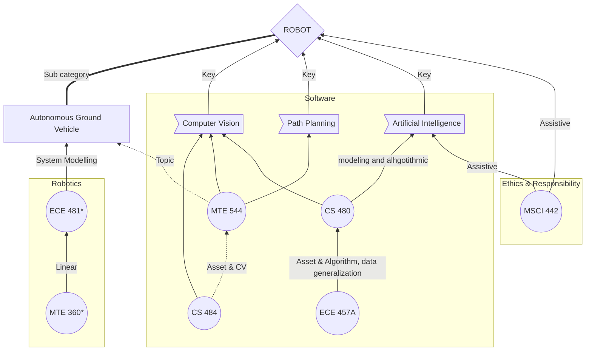

# AI option

 Nov. 25, 2018 AI option Mechatronics

Situation: I am a 2B [Mechatronics Student][2] @UW and plan to take an AI option

The [AI Option][1] will be available for Bachelor of Applied Science (BASc) students in all undergraduate engineering programs at the University of Waterloo. The requirements for option completion are  : 

#### **All of** 

- [x] ==**[ECE 457A ](https://ugradcalendar.uwaterloo.ca/courses/ECE/457A)Cooperative and Adaptive Algorithms**==,
- [ ]  or [MSCI 435](https://ugradcalendar.uwaterloo.ca/courses/MSCI/435) Advanced Optimization Techniques
- [x] **==[MSCI 442](https://ugradcalendar.uwaterloo.ca/courses/MSCI/442) Impact of Information Systems on Organizations and Society==**

#### **One of 3** 

- [x] ==**[CS 480](https://ugradcalendar.uwaterloo.ca/courses/CS/480) Introduction to Machine Learning**==
- [ ] [ECE 457B](https://ugradcalendar.uwaterloo.ca/courses/ECE/457B) Fundamentals of Computational Intelligence 
- [ ] [MSCI 446](https://ugradcalendar.uwaterloo.ca/courses/MSCI/446) Data Warehousing and Mining

#### **One of 6**
- [ ] [BME 356](https://ugradcalendar.uwaterloo.ca/courses/BME/356) Control Systems
- [ ] [CHE 420](https://ugradcalendar.uwaterloo.ca/courses/CHE/420) Introduction to Process Control
- [ ] [ECE 380](https://ugradcalendar.uwaterloo.ca/courses/ECE/380) Analog Control Systems
- [x] ==**[MTE 360](https://ugradcalendar.uwaterloo.ca/courses/MTE/360) Automatic Control Systems**== ==**:: Already in the curriculum by default | 3B MTE360**==
- [ ] [SE 380](https://ugradcalendar.uwaterloo.ca/courses/SE/380) Introduction to Feedback Control
- [ ] [SYDE 352](https://ugradcalendar.uwaterloo.ca/courses/SYDE/352) Introduction to Control Systems

#### **Three additional courses**

- [ ] [CHE 522](https://ugradcalendar.uwaterloo.ca/courses/CHE/522) Advanced Process Dynamics and Control
- [ ] [CHE 524](https://ugradcalendar.uwaterloo.ca/courses/CHE/524) Process Control Laboratory
- [ ] [CO 456](https://ugradcalendar.uwaterloo.ca/courses/CO/456) Introduction to Game Theory
- [ ] [CO 463](https://ugradcalendar.uwaterloo.ca/courses/CO/463) Convex Optimization and Analysis
- [ ] [CO 466](https://ugradcalendar.uwaterloo.ca/courses/CO/466) Continuous Optimization
- [ ] **[CS 452](https://ugradcalendar.uwaterloo.ca/courses/CS/452) Real-time Programming (only for Math/Computer Science students)**
- [ ] [CS 480](https://ugradcalendar.uwaterloo.ca/courses/CS/480) Introduction to Machine Learning
- [x] **==[CS 484](https://ugradcalendar.uwaterloo.ca/courses/CS/484) Computational Vision==**
- [ ] [CS 485](https://ugradcalendar.uwaterloo.ca/courses/CS/485) Statistical and Computational Foundations of Machine Learning
- [ ] [ECE 423](https://ugradcalendar.uwaterloo.ca/courses/ECE/423) Embedded Computer Systems
- [x] ==**[ECE 481](https://ugradcalendar.uwaterloo.ca/courses/ECE/481) Digital Control Systems**== ==**:: Already in the curriculum by default | 4A ECE484 - Digital Control Applications**== 
- [ ] [ECE 486](https://ugradcalendar.uwaterloo.ca/courses/ECE/486) Robot Dynamics and Control
- [ ] **[ECE 488](https://ugradcalendar.uwaterloo.ca/courses/ECE/488) Multivariable Control Systems**
- [ ] [MSCI 446](https://ugradcalendar.uwaterloo.ca/courses/MSCI/446) Data Warehousing and Mining
- [x] ==**[MTE 544](https://ugradcalendar.uwaterloo.ca/courses/MTE/544) Autonomous Mobile Robots**==
- [ ] [STAT 341](https://ugradcalendar.uwaterloo.ca/courses/STAT/341) Computational Statistics and Data Analysis
- [ ] [STAT 440](https://ugradcalendar.uwaterloo.ca/courses/STAT/440) Computational Inference
- [ ] [STAT 441](https://ugradcalendar.uwaterloo.ca/courses/STAT/441) Statistical Learning - Classification
- [ ] [STAT 444](https://ugradcalendar.uwaterloo.ca/courses/STAT/444) Statistical Learning - Function Estimation
- [ ] [SYDE 372](https://ugradcalendar.uwaterloo.ca/courses/SYDE/372) Introduction to Pattern Recognition
- [ ] [SYDE 522](https://ugradcalendar.uwaterloo.ca/courses/SYDE/522) Machine Intelligence
- [ ] [SYDE 556](https://ugradcalendar.uwaterloo.ca/courses/SYDE/556) Simulating Neurobiological Systems

Note: At least one of the “Three additional courses” must be from Math and at least one from Engineering. Special topics courses may sometimes be appropriate for this option; interested students should see the [option co-ordinator](https://uwaterloo.ca/engineering/designated-options-and-co-ordinators) for confirmation.

---

## Notations

S: Spring

W: Winter

F: Fall

[Undefined] : Undeclared

---

## Course Details

### All of

1. - [x] **ECE 457A LEC,TST,TUT 0.50** | **Cooperative and Adaptive Algorithms** | ID: 013441  

     Spring

   - The course starts by addressing the ill-structured problems and need for computational intelligence methods. It introduces the **concepts of heuristics** and their use in conjunction with search methods, **solving problems using heuristics and metaheuristics, constraints satisfaction**. The course also introduces the **concepts of cooperation and adaptations** and how they are influencing new methods for solving complex problems. The course starts by illustrating how the concepts of cooperation and adaptation are manifested in nature and how such models are inspiring new types of solutions methods. Topics to be covered include: **search algorithms**, **game playing**, **constraints satisfaction**, meta-heuristics, evolutionary computing methods, **swarm intelligence**, **ant-colony algorithms**, particle swarm methods, adaptive and learning algorithms and the use of these algorithms in solving continuous and discrete problems that arise in engineering applications. [Offered: S]

   - *Prereq: ==Level at least 4A== Computer Engineering or Electrical Engineering or Software Engineering.*

   - *Antireq: CS 486, SYDE 422/522*

   - [ ] **MSCI 435 LEC,TUT 0.50** | **Advanced Optimization Techniques** | ID: 012389 

        Winter
   - This course covers more advanced topics in **optimization** that go beyond the contents of MSCI 331 and MSCI 332. The course will cover topics such as **constraint programming,** **stochastic programming**, **large scale optimization**, or **complementarity problems**. [Offered: W]
   - *Prereq: MSCI 331, 332*

2. - [x] **MSCI 442 LEC,TUT 0.50** | **Impact of Information Systems on Organizations and Society** | ID: 006826 

       Winter

   - This course is designed to familiarize the student with issues related to the **impact of computer-based technologies** on individual jobs, organizations, and broader societal level. Particular emphasis will placed on critical examination of various issues including privacy, security, **ethical** concern and professional responsibilities. [Offered: W]
   - *Prereq: ==Level at least 3A Engineering==*

### One of 3

1. - [x] **CS 480 LAB,LEC,TST 0.50** | **Introduction to Machine Learning**  

     Spring  Winter  Fall

   - Introduction to **modeling and alhgotithmic** techniques for machines to learn concepts from data generalization: undercutting, overfitting, cross-validation. Tasks: **classification, regression, clustering**. Optimization-based learning: **loss minimization, regularization, Statistical learning: maximum likelihood, Bayesian learning.** Algorithms: nearest neighbour, (generalized) linear regression, mixtures of **Gaussians**, Gaussian processes, **kernel methods,** support vector machines, **deep learning**, **sequence learning**, ensemble techniques. Large scale learning: distributed learning and stream learning. Applications: **Natural language processing, computer vision, data mining, human computer interaction**, information retrieval.

   - *[Note: Lab is not scheduled and students are expected to find time in open hours to complete their work. Offered: F,W,S]*

   - *Prereq: CS 341 and (STAT 206 or 231 or 241); Computer Science and BMath (Data Science) students only.*

2. - [ ] **ECE 457B LEC,TST,TUT 0.50** | **Fundamentals of Computational Intelligence**

     Winter

   - Introduces novel approaches for **computational intelligence** based techniques including: **knowledge based reasoning**, **expert systems**, **fuzzy inferencing** and connectionist modeling based on **artificial neural networks**. The focus is on the use of soft computing approaches to deal effectively with real world complex systems for which their mathematical or physical models are either non-tractable or are difficult to obtain. The main thrust is on designing computationally intelligent systems with human like capabilities in terms of reasoning, learning and adaptation. Tools of computational intelligence could be used in a wide range of engineering applications involving real world problems such as in: **planning problems, intelligent control, autonomous robotics, speech understanding, pattern analysis, network design, face recognition, communication systems to name a few**. [Offered: W]

   - *Prereq: ==Level at least 4A== Computer Engineering or Electrical Engineering or Mechatronics Engineering or Software Engineering or Systems Design Engineering.*

   - *Antireq: SYDE 558*

3. - [ ] **MSCI 446 LEC,TUT 0.50** | **Data Warehousing and Mining****

     Fall

   - This course will present state-of-the-art practice and research in the **storage, extraction, manipulation and analysis of data,** with a view to using these processes for **making better management decisions**. Topics include: **extracting, cleaning, and organizing data from transactional databases**, discovering and validating patterns and relationships using statistical techniques, and using the extracted patterns for making improved management decisions. [Offered: F]
   - *Prereq: One of BME 411, CIVE 332, CO 250, ENVE 320/335, MSCI 331, or SYDE 411; Level at least 3A; (One of CS 348, ECE 356, MSCI 346) and (One of CHE 220, CIVE 224, ECE 316, ENVE 224, MSCI 252, ME 202, MTE 201, NE 115/215, STAT 206, 231, 241, SYDE 212)*

### One of 6

1. - [x] **MTE 360 LAB,LEC,TUT 0.50** | **Automatic Control Systems**

     **Already in the curriculum by default**

   - Feedback control design and analysis for **linear dynamic systems** with emphasis on **mechanical engineering applications**; transient and frequency response; **stability**; system **performance**; **control modes**; state space techniques; Introduction to digital control systems. [Offered: F,W]

   - *Prereq: MTE 320, SYDE 252, 351; Level at least 3B Mechatronics Engineering.*

   - *Antireq: ECE 380, ME 360, SYDE 352*

### Three Additional

1. - [x] **MTE 544 LAB,LEC,TUT 0.50** | **Autonomous Mobile Robots**

     Fall

   - Fundamentals of autonomous mobile robotics, including both **perception** and **planning for autonomous operation**, **sensor modelling**, **vehicle state estimation** using **Bayes Filters**, **Kalman Filters**, and **Particle Filters** as well as **onboard localization and mapping**. Topics in planning include **vehicle motion modelling and control**, as well as **graph based and probabilistic motion planning** of (Micro Electro Mechanical Systems) MEMS devices. [Offered: F]
   - *Prereq: ==Level at least 3B== Computer, Electrical, Mechanical, Mechatronics, or Systems Design Engineering*

2. - [x] **CS 484 LAB,LEC,TST 0.50** | **Computational Vision**

      Undeclared

   - Introduction to **image and vision** understanding by computer. Camera-system **geometry, image formation** and **lighting**, and **image acquisition**. Basic visual processes for recognition of edges, regions, lines, and surfaces. Processing of **stereo images**, and **motion** in image sequences. **Object recognition**. Applications of computer-vision systems.

   - *[Note: Lab is not scheduled and students are expected to find time in open hours to complete their work.]*

   - *Prereq: (AMATH 242/CS 371 or CS 370) and STAT 230 or 240; Computer Science students only*

3. - [ ] **CS 452 LAB,LEC,TST 0.50** | **Real-time Programming** | Course ID: 004419

     Spring  Winter  

   - Intended to give students experience with tools and techniques of **real-time programming**, this course includes not only issues of **microcomputer architecture and a real-time programming language and operating system**, but also hands-on experience programming a **microcomputer for applications such as process control, data acquisition and communication.**

   - *[Note: This course ==involves project work==. Offered: W,S]*

   - *Prereq: CS 350 or SE 350; Computer Science students only*

4. - [x] **ECE 481 LAB,LEC,TST,TUT 0.50** | **Digital Control Systems**

      **Already In the curriculum by default**

   - Performance specifications for design. **Dynamic system modelling and basic system identification.** Dealing with basic nonlinear effects. Sampled data systems. Discrete-time system stability and dynamic performance. Digital control system design: emulation methods, z-domain, frequency domain, pole placement. Implementation of digital controllers. [Offered: S]

   - *Prereq: (ECE 380 or MTE 360 or SYDE 352; Level at least 4A Computer Engineering or Electrical Engineering or Systems Design Engineering) or (ECE 207, SE 380; Level at least 4A Software Engineering).*

   - *Antireq: ECE 484*

## My Decision

My decisions were highlighted in the first section with yellow markers. 

#### **All of** 

- [x] ==**[ECE 457A ](https://ugradcalendar.uwaterloo.ca/courses/ECE/457A)Cooperative and Adaptive Algorithms**==
- [x] **==[MSCI 442](https://ugradcalendar.uwaterloo.ca/courses/MSCI/442) Impact of Information Systems on Organizations and Society==**

#### **One of 3** 

- [x] ==**[CS 480](https://ugradcalendar.uwaterloo.ca/courses/CS/480) Introduction to Machine Learning**==

#### **One of 6** 
- [x] ==**[MTE 360](https://ugradcalendar.uwaterloo.ca/courses/MTE/360) Automatic Control Systems**== ==**:: Already in the curriculum by default | 3B MTE360**==

#### **Three Additional** 
- [x] **==[CS 484](https://ugradcalendar.uwaterloo.ca/courses/CS/484) Computational Vision==**
- [x] ==**[ECE 481](https://ugradcalendar.uwaterloo.ca/courses/ECE/481) Digital Control Systems**== ==**:: Already in the curriculum by default | 4A ECE484**== 
- [x] ==**[MTE 544](https://ugradcalendar.uwaterloo.ca/courses/MTE/544) Autonomous Mobile Robots**==

## Reference

[1]: http://ugradcalendar.uwaterloo.ca/page/ENG-Option-in-Artificial-Intelligence
[2]: https://ugradcalendar.uwaterloo.ca/page/ENG-Mechatronics-Engineering