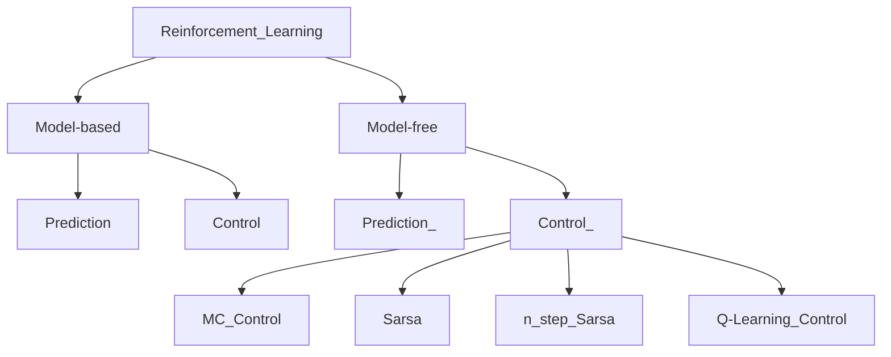

## Reinforcement Learning

#### RL: Value function

- Reward Function: maps each perceived state of the environment to a scalar, a reward, indicating the intrinsic desirability of that state.
  - determine the immediate, intrinsicn desirability of env. states.
  - sole objective of RL agent => maximize **total reward**
- Value Function: Specifying what is good in the long run. Indicates long-term desirability of the states
  - expected cumulative rewards
    - State val func. V
    - Action val func. Q

#### Agent: Model

- A model built by agent => predict what env. will do next
  - Transition model P
  - Reward model R

- Markov States. P $[\ref{trans_P}]$, R$[\ref{reward_R}]$ [Equations]
    
   $$ P^a_s = P[S_{i+1} = s' | s_t = s, a_t = a] \label{trans_P} $$
   $$ R^a_{ss'}=E[r_{i+1}|s_t=s, a_t=a,s_{i+1}=s'] \label{reward_R} $$

#### RL (Reinforcement Learning)

```sequence
Environment->Agent: state S and Reward R
Note right of Agent: Imitation Learning
Agent->Environment: Action: a
```


#### Types of RL Algorithms



##### ==QLearning Algorithm==

- Q learning is a **model-free + off-policy** learning algorithm

- Off-policy => next action is not chosen by $\epsilon-greedy policy$

  -  Updating rule of action value function :

  - $\alpha$ is called learning rate and $\gamma$ is the discount factor

  - When $\alpha$ is equal to 1, the updating rule is:
    $$
    Q(s_t,\alpha_t) \leftarrow r_{t+1} + \gamma \max_{\alpha} Q(s_{t+1}, \alpha_t)
    $$

- Pseudocode of Q-learning algorithm is:

  > Algorithm param: step size $\alpha \in (0,1]$ , small $\epsilon > 0$
  >
  > Initialize $Q(s,\alpha), \forall \space  s \in \mathbb{S}^+, \alpha \in \mathbb{A}(s)  $, arbitrarily except that Q(terminal, .) = 0
  >
  > Loop for each episode:
  >
  > ​	Initialize S
  >
  > ​	Loop for each step of episode:
  >
  > ​		Choose A from S using policy derived from Q
  >
  > ​	...


##### ==Sarsa Algorithm==

- **Model-free + on-policy**
- ==**On-policy**== means next action is also chosen by  $\epsilon-greedy policy$


#### RL-based Highway Overtaking Decision Making

- **Sarsa** vs. **Q-learning**
- **Sarsa** converges slower
- **Q-learning** will stop at the beginning, so the convergence speed is slower


## Note:

- It is hard to design best rewarding functions
  - One approach: use Inverse Reinforcement Learning (IRL) to figure out the reward function.


$$ x=\frac{ -b\pm\sqrt{ b^2-4ac } } {2a} $$
$$ \def\bar#1{#1^2} \bar{y} $$

$$
\begin{matrix}
   a & b \\\
   c & d 
\end{matrix}
$$