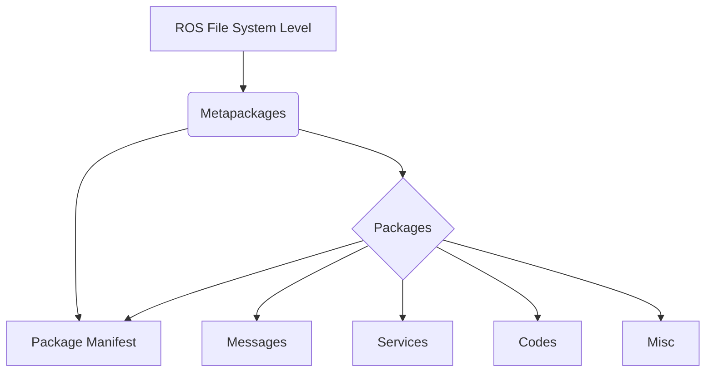
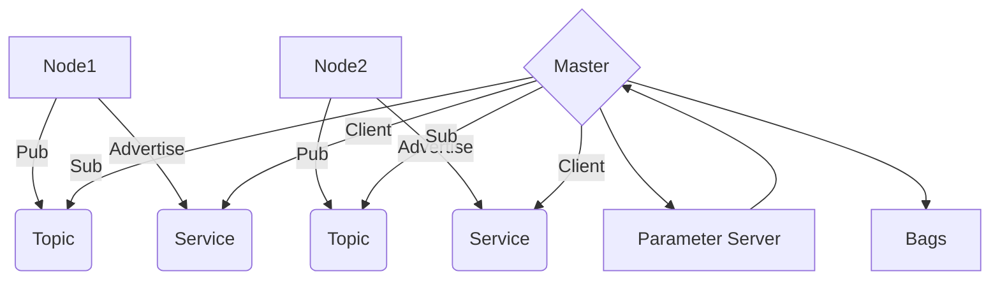

## ROS Note

### About

This ros note can be referred to “ROS Robotics Projects - Lentin Joseph”

## Chapter 01 - Intro.

### Popular Hardware Supported by ROS:
1. [Robots supported by ROS](https://robots.ros.org/)
   1. [Pepper](http://wiki.ros.org/action/show/pepper?action=show&redirect=Robots%2FPepper)
   2. [Robonaut](http://wiki.ros.org/Robots/Robonaut2)
   3. [TurtleBot 2](http://wiki.ros.org/Robots/TurtleBot)
   4. [Universal Robotic Arms](http://wiki.ros.org/universal_robot)
2. [Sensors](http://wiki.ros.org/Sensors)
   1. [ZED Camera](http://wiki.ros.org/zed-ros-wrapper)
   2. [Hokuyo laster range finder](http://wiki.ros.org/hokuyo_node)
   3. [Intel RealSense](http://wiki.ros.org/realsense_camera)
   4. Teraranger
   5. Xsens

### Why ROS?

- **Collaborative Dev.**
- **Language Support:**
  - C++
  - Python 
  - Lisp
  - Java 
  - Lua
- **Library Integration:**
  - [Open-CV](http://wiki.ros.org/vision_opencv)
  - [PCL (Point Cloud Library)](http://wiki.ros.org/pcl_ros)
  - [OpenNI](http://wiki.ros.org/openni_launch) : OpenNI device and load all nodelets to convert raw depth/RGB/IR streams to depth images, disparity images, and (registered) point clouds.
- Simulation Integration
  - Gazebo
- Code Testing
  - Rostest to check code quality and bugs
- Scalability
  - Scalable + we can perform heavy computation tasks with robots
- Customizability
- Community
  - Community-driven project.

### USEFUL LINKS

- [ROS Answers](https://answers.ros.org/questions/) : Stack Overflow of ROS

### Fundamentals of ROS

#### File System Level:

- File **System** Level
  - **Metapackages**: group together a list of packages for a specific application. It can hold info. on related packages to install
  - **Packages**: Software in ROS is mainly organized as ROS packages. 
    - ROS packages are the atomic build unit of ROS
    - This single module consists of:
      - ROS nodes/processes
      - datasets
      - configuration files 
  - **Package** **Manifest**: Every package will contain a manifest file called ==package.xml==
    - It consists of info. such as the name, version, author, license, and dependencies required for the package
    - The package.xml of a @Metapackage consists of the names of related packages
  - **Messages(msg)**: ROS communicates by sending ROS msgs. Type of msg data defined inside a file with ==.msg==. (File hierarchy convention: pkg_name/msg/msgName.msg) “More like a P2P DM”
  - **Service(srv)**: “Broadcasting” kinda of idea. Services: client and server. Same idea as network.

#### Computation Graph Level

- Graph Level:
  - **Nodes**: 
    - A process uses ROS APIs to comm. with each other
  - **Master**: 
    - an intermediate node that aids connections btwn diff. ROS nodes.
    - It has all the details about all nodes running in ROS env.
    - Help to establish communication btween the two ROS nodes.
  - **Parameter Server**:
    - Pretty useful thing
    - A node can ==store a variable== in the parameter server and set its ==privacy==
    - if it is global scope, it can be accessed by all other nodes
    - Runs along with ROS master
  - **Messages**:
    - a data structure used by ROS nodes to ==exchange data==
    - nodes send and recv. data in the form of ROS msgs. 
  - **Topics**:   
    - Topics are ==named buses==, in which data is exchanged ==using ROS msgs==. 
    - Each topic has a specific name
    - One node can ==**publish**== data to a topic, and other nodes can read from the topic by ==**subscribing**==
  - **Services**:
    - a request and response method is used.
    - One node can act as the service provider by ==**advertising**==, and other nodes can be client to request services and wait until the server responds with the results.
  - **Bags**:
    - Useful utility in ROS for recording and playback of ROS topics
    - We can record sensor data and play back

### ROS Client Libs

- roscpp: high-performance applications & recommended
- Rosy: pure implementation of the ROS client library in Python.

### ROS Tools

- Rviz (ROS Visualizer): visualize both 2D & 3D values from ROS topics and parameters
- Rqt_plot: plotting scalar values that are in the form of ROS topics
- rqt_graph: ROS GUI tool can visualize the graph of interconnection btwn ROS nodes

### VM

- #. of CPUs: 1
- RAM: 4GB
- Display: 128 MB
- Acceleration: 3D
- Storage: 20~30 GB
- Network adapter on NAT

## Libraries

### Deep Learning

- [TensorFlow](https://www.tensorflow.org/)
  - open source lib for numerical computation using data flow graphs
- [Theano](http://deeplearning.net/software/theano/)
  - Open source Python Library that enables us to optimize and evaluate mathematical expressions involving multidimensional arrays effieciently.
- [Torch](http://torch.ch/)
  - Scientific computing framework with wide support for ML also. 
  - puts GPUs first. Versy efficient, built on LuaJIT and has an underlying C/CUDA implementation
- [Caffe](http://caffe.berkeleyvision.org/)
  - focus on modularity, speed and expression
- LCM :: https://lcm-proj.github.io/

​	